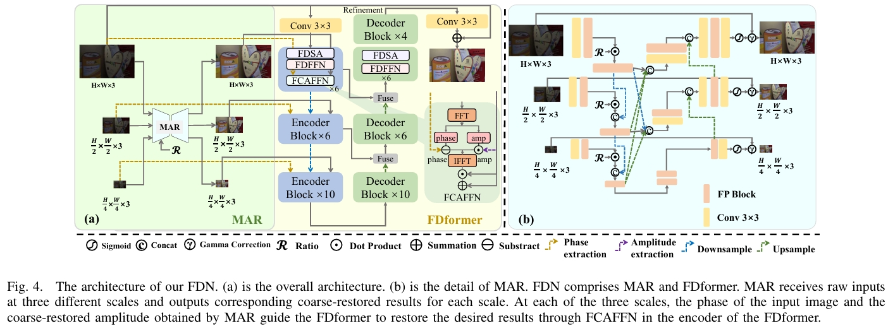
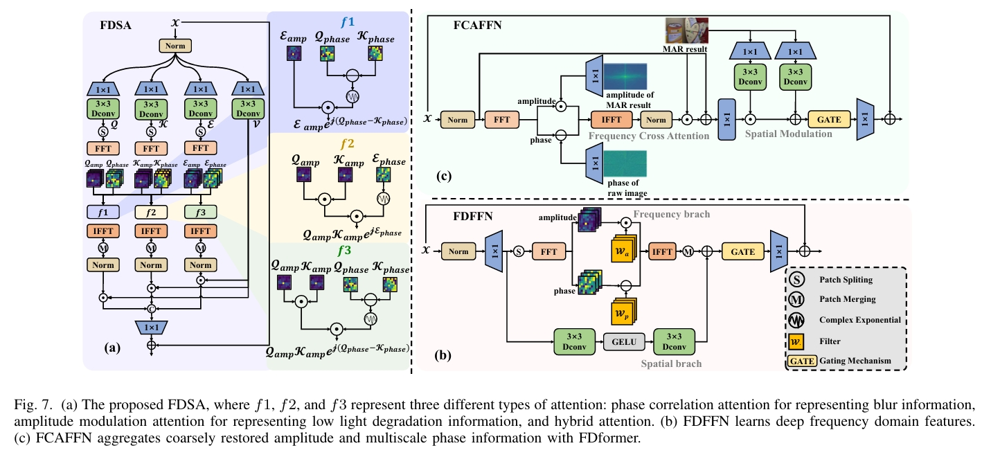

# Fourier-based Decoupling Network for Joint Low-Light Image Enhancement and Deblurring (FDN)

[](https://ieeexplore.ieee.org/document/11105001) [](https://github.com/Jabruson/FDN-TIP2025)

This is the official PyTorch implementation of the paper **"Fourier-based Decoupling Network for Joint Low-Light Image Enhancement and Deblurring"**. (IEEE TIP 2025)

This paper has been accepted by IEEE TRANSACTIONS ON IMAGE PROCESSING.

*By Luwei Tu, Jiawei Wu, Chenxi Wang, Deyu Meng, and Zhi Jin.*

---

## Abstract

Nighttime handheld photography is often simultaneously affected by low light and blur degradations due to object motion and camera shake. Previous methods typically design specific modules to restore the degradations in the spatial domain independently. However, the interdependence of low light and blur degradations in the spatial domain makes it difficult for these approaches to effectively decouple the degradations. In this paper, we observe that in the Fourier domain, low light and blur degradations can be represented independently in the amplitude and phase of the image. We discover that low light degradation exhibits distinct characteristics across different frequency bands in amplitude, while blur degradation is characterized by phase correlation. Leveraging these insights, we propose a Fourier-based Decoupling Network (FDN) for joint low-light image enhancement and deblurring. Experimental results demonstrate that our method achieves state-of-the-art performance on both synthetic and real-world datasets and exhibits significantly sharper edges.

---
## FDN Network Architecture
### Overall

### FDformer

## Preparation
LOL-BLur dataset and Real-LOL-Blur dataset can be find in LEDNet [Link](https://drive.google.com/file/d/1RhGZxj0crlrEG1z4kQuuxk-yRVP9h9lI/view?usp=drive_link): 

## Results

### LOL-Blur Dataset
- **Google Drive:** [Link](https://drive.google.com/file/d/1RhGZxj0crlrEG1z4kQuuxk-yRVP9h9lI/view?usp=drive_link)
- **Baidu Pan:** [Link](https://pan.baidu.com/s/1eDegIuW3YfuX9J9dx-T4Ig) (Extraction code: 2khw)

### Real-LOL-Blur Dataset
- **Google Drive:** [Link](https://drive.google.com/file/d/1jOaUSTRh1OYfNDYPnpHFauP_XlH21Rgv/view?usp=drive_link)
- **Baidu Pan:** [Link](https://pan.baidu.com/s/1zibBq9YPLZ2HGXsvsmOtmA) (Extraction code: uw61)

### LOL-v1 Dataset
- **Google Drive:** [Link](https://drive.google.com/file/d/1P-59kykpinA5MyyniBkTC8x2YT1LolU1/view?usp=drive_link)

## Testing
The pretrain modles is available at FDN/checkpoint/
1. **LOL-Blur Testing (also available for other dataset):**
   ```python
    python inference_fdn_lolblur.py
    ```
2. **LOL-V1 Testing (also available for other dataset):**
   ```python
    python inference_fdn_lolv1.py
    ```
3. **Metric testing:**
   ```python
    python m.py -m psnr ssim lpips
    ```
## Training

The training process (you should change your data root in options):

1.  **MAR Training:**
    ```bash
    sh MAR.sh
    ```

2.  **FDN Training:**
    ```bash
    sh fdn.sh
    ```

3.  **LPNet Training:**
    ```bash
    sh train_lpnet.sh
    ```
