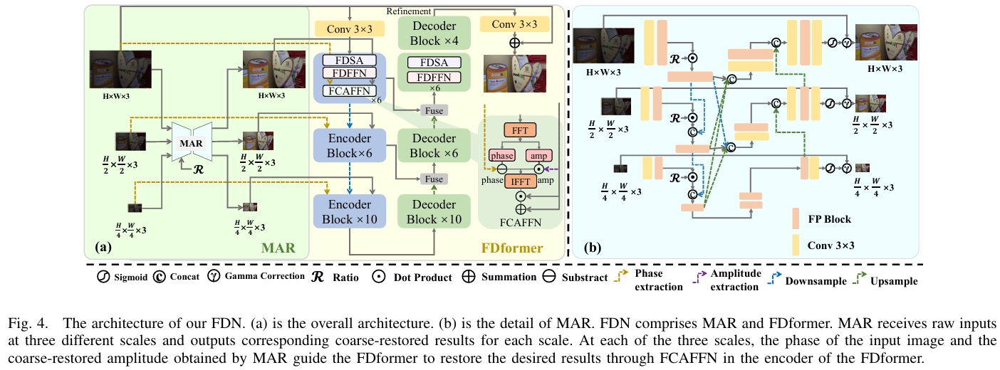
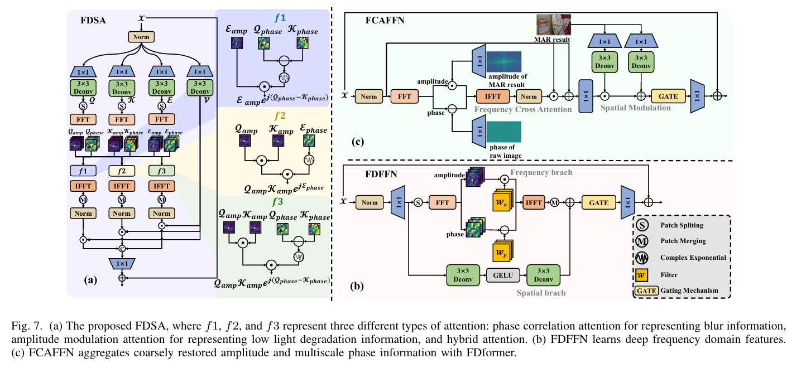

# Fourier-based Decoupling Network for Joint Low-Light Image Enhancement and Deblurring (FDN)

<div align="center">

[](https://ieeexplore.ieee.org/document/11105001)
[](https://pytorch.org/)
[](https://opensource.org/licenses/MIT)

**Official PyTorch Implementation**

**"Fourier-based Decoupling Network for Joint Low-Light Image Enhancement and Deblurring"**
*(IEEE Transactions on Image Processing, 2025)*

**Luwei Tu, Jiawei Wu, Chenxi Wang, Deyu Meng, and Zhi Jin**

</div>

---

## 📖 Abstract

Nighttime handheld photography is often simultaneously affected by **low light** and **blur degradations** due to object motion and camera shake. Previous methods typically design specific modules to restore the degradations in the spatial domain independently. However, the interdependence of low light and blur degradations in the spatial domain makes it difficult for these approaches to effectively decouple them.

In this paper, we observe that in the Fourier domain:
1. Low light and blur degradations can be represented independently in the **amplitude** and **phase** of the image.
2. Low light degradation exhibits distinct characteristics across different frequency bands in amplitude.
3. Blur degradation is characterized by phase correlation.

Leveraging these insights, we propose a **Fourier-based Decoupling Network (FDN)** for joint low-light image enhancement and deblurring. Experimental results demonstrate that our method achieves state-of-the-art performance on both synthetic and real-world datasets and exhibits significantly sharper edges.

---

## 🏗️ Network Architecture

### Overall Architecture
<div align="center">
  
</div>

### FDformer Module
<div align="center">
  
</div>

---

## ⚙️ Dependencies and Installation

We recommend using **Anaconda** to create a virtual environment.

```bash
# 1. Create and activate environment
conda create -n fdn python=3.8
conda activate fdn

# 2. Install PyTorch (Adjust CUDA version as needed)
pip install torch==1.11.0+cu113 torchvision==0.12.0+cu113 --extra-index-url [https://download.pytorch.org/whl/cu113](https://download.pytorch.org/whl/cu113)

# 3. Install dependencies
pip install scikit-image opencv-python tensorboard einops
# Alternatively, use the requirements file
pip install -r requirements.txt
---

## 📂 Dataset Preparation

### 1. Download Datasets

The **LOL-Blur** and **Real-LOL-Blur** datasets can be found in the [LEDNet Repository](https://github.com/sczhou/LEDNet).


```

---

## 🚀 Training

To train the model, please verify your `data_root` in the option files/scripts. The training process consists of three stages:

### Stage 1: MAR Training

```bash
sh MAR.sh

```

### Stage 2: FDN Training (Main)

```bash
sh fdn.sh

```

### Stage 3: LPNet Training

```bash
sh train_lpnet.sh

```

---

## ⚡ Testing

Pre-trained models are available in the `FDN/checkpoint/` directory.

### Inference Scripts

**1. LOL-Blur Dataset** (and other synthetic datasets):

```bash
python inference_fdn_lolblur.py

```

**2. LOL-v1 Dataset** (and other real-world datasets):

```bash
python inference_fdn_lolv1.py

```

### Evaluation

To calculate PSNR, SSIM, and LPIPS metrics:

```bash
python m.py -m psnr ssim lpips

```

---

## 🏆 Results & Pre-trained Models

We provide the processed results and pre-trained weights for reproduction.

| Dataset | Google Drive | Baidu Pan (Code) |
| --- | --- | --- |
| **LOL-Blur Results** | [Download Link](https://drive.google.com/file/d/1RhGZxj0crlrEG1z4kQuuxk-yRVP9h9lI/view?usp=drive_link) | [Download Link](https://pan.baidu.com/s/1eDegIuW3YfuX9J9dx-T4Ig) (Code: `2khw`) |
| **Real-LOL-Blur Results** | [Download Link](https://drive.google.com/file/d/1jOaUSTRh1OYfNDYPnpHFauP_XlH21Rgv/view?usp=drive_link) | [Download Link](https://pan.baidu.com/s/1zibBq9YPLZ2HGXsvsmOtmA) (Code: `uw61`) |
| **LOL-v1 Results** | [Download Link](https://drive.google.com/file/d/1P-59kykpinA5MyyniBkTC8x2YT1LolU1/view?usp=drive_link) | — |

---

## 🔗 Citation

If you find this work helpful, please consider citing:

```bibtex
@article{tu2025fourier,
  author={Tu, Luwei and Wu, Jiawei and Wang, Chenxi and Meng, Deyu and Jin, Zhi},
  journal={IEEE Transactions on Image Processing}, 
  title={Fourier-Based Decoupling Network for Joint Low-Light Image Enhancement and Deblurring}, 
  year={2025},
  volume={34},
  pages={5184-5199},
  doi={10.1109/TIP.2025.3592559}
}

```

